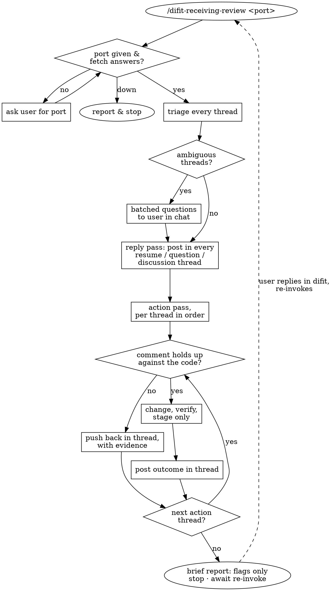

Work code-review comments left in a running difit (available in PATH) session. One invocation runs one pass; the user re-invokes to resume discussions and pick up new comments.



## Pass

1. **Take the port.** The user invokes this skill with the difit server's port. Missing or wrong port → ask the user for it. Verify by fetching:

   ```bash
   difit comment get --port <N> --format json
   ```

   Fetch fails → the port is wrong or the server is down; tell the user and stop.

2. **Fetch and triage every thread.** The fetch returns `{"threads": [...]}` (schema below). Classify each thread by its message history and the intent of the newest **user** message (author ≠ `agent`):

   - **resume** — the thread has user messages after the agent's last reply: continue that discussion in the thread.
   - **question** — asks for explanation/clarification: answer it.
   - **action** — directs a change: make the change.
   - **discussion** — invites proposals ("any ideas how to improve?"): open with your position.
   - **ambiguous** — could be question or action ("this won't work"): collect all ambiguous threads and put them to the user in chat, batched, before acting on any of them.

   Done when every thread has exactly one classification.

3. **Reply in every thread.** For each question, discussion, and resume: post your answer/position into the thread itself (posting replies, below). Reply substance lives in the thread, never in chat — the user runs several discussions in parallel there.

   Done when every question, discussion, and resume thread has a fresh `agent` reply.

4. **Work actions per-thread, in order.** For each action thread: verify the concern against the code; if you believe the comment is wrong or the fix harmful, push back in the thread with evidence (code refs, command output) and leave the code untouched until the user answers. Otherwise make the change, choose a verification bar that fits the change, run it, and post the outcome as a reply in the thread. Stage the result (`git add`) and leave it uncommitted — the user reviews the staged diff and commits.

   Done when every action thread is either changed-and-staged with results posted, or pushed back with evidence.

5. **Report briefly.** Short prose in chat: only flags, disagreements awaiting the user's answer, and anything needing attention. The threads are the record.

   Then stop. Discussions pause here — the user replies in difit and re-invokes this skill to resume.

## Posting replies

Reply to a thread by injecting a reply at the thread's file and position:

```bash
difit comment add --port <N> '{"type":"reply","filePath":"<thread.filePath>","position":<thread.position verbatim>,"body":"<your reply>","author":"agent"}'
```

A reply attaches to the newest thread matching file+position — one thread per position when you reply; if two threads share a position, post to the newest (difit does this too).

## Thread JSON schema

```
thread:  { id, filePath, position: {side: "old"|"new", line: number|{start,end}},
           messages: [message, ...], createdAt, updatedAt, codeSnapshot? }
message: { id, body, author, createdAt, updatedAt }
```

`position.line` refers to the side's line in the diff view. Messages after the first are replies, ordered by `createdAt`. The last message with `author === "agent"` marks how far you've answered; user messages past it are what you're resuming.

## Rules

- The user resolves threads in the difit UI. You never run `difit comment resolve`.
- Every reply you post carries `author: "agent"`.
- One invocation = one pass, ending at the report. Resuming and new comments arrive by the next invocation — the same flow handles both.
